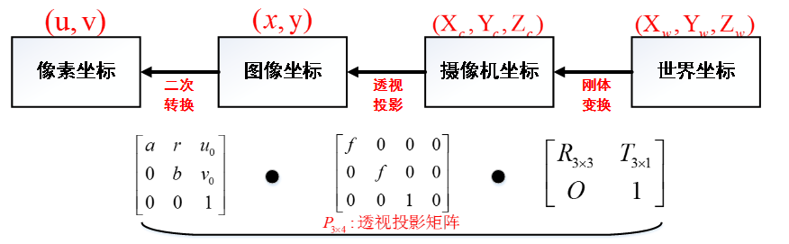
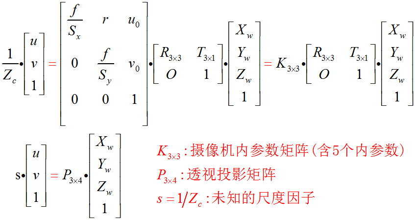

## 使用 Matlab+OpenCV 进行摄像头标定
### OpenCV配置
配置可见[OpenCV](http://liangsong.top/2017/11/04/OpenCV%E5%BA%93%E7%9A%84%E9%85%8D%E7%BD%AE/)
### Matlab环境配置
需要安装Matlab runtime
### 张正友方法简介
张正友标定法是指张正友教授1998年提出的单平面棋盘格的摄像机标定方法。文中提出的方法介于传统标定法和自标定法之间，但克服了传统标定法需要的高精度标定物的缺点，而仅需使用一个打印出来的棋盘格就可以。同时也相对于自标定而言，提高了精度，便于操作。因此张氏标定法被广泛应用于计算机视觉方面。  

张正友方法实际是求解三维世界坐标系中的坐标 $[X, Y, Z, 1]^T$ 到二维像素平面 $[u,v,1]^T$的单应关系。


具体推导可参考[张正友方法推导详情](http://blog.csdn.net/humanking7/article/details/44756235)
### 具体代码实现
- 使用OpenCV打开摄像头拍摄照片
```C++
int TakePhoto(char *path, int choice)
{
    char keyCode;
    VideoCapture capture(choice);//打开制定摄像头
    int count = 1;
    if (!capture.isOpened())
        return -1;
    Mat frame;
    while (keyCode = cvWaitKey(30))
    {
        if (keyCode == 27)
        {
            break;
        }//如果按esc键退出拍摄

        capture >> frame;
        imshow("读取视频", frame);
        if (keyCode == 13)
        {//按enter拍摄图片
            std::string name = std::string(path) + "chess" + std::to_string(count) + ".jpg";
            imwrite(name, frame);//将图片保存为jpg文件
            ++count;
        }
    }

    return 1;
}

```
- 使用 Matlab/OpenCV 获取图片中的棋盘格点
---
- Matlab
```
for i = 1:5
  imageFileName = sprintf('image%d.tif', i);
  imageFileNames{i} = fullfile(matlabroot, 'toolbox', 'vision',...
          'visiondata','calibration','webcam',imageFileName);
end
% 读取图片
[imagePoints, boardSize, imagesUsed] = detectCheckerboardPoints(imageFileNames);
% 获取棋盘格点坐标
imageFileNames = imageFileNames(imagesUsed);
for i = 1:numel(imageFileNames)
  I = imread(imageFileNames{i});
  subplot(2, 2, i);
  imshow(I); hold on; plot(imagePoints(:,1,i), imagePoints(:,2,i), 'ro');
end
% 显示棋盘格点
```
- OpenCV + C++
```C++
    for (int i = 0; i < FILES_NUMBER; ++i) {
        std::string file_name = FILE_PATH + FILE_NAME + std::to_string(i + 1) + FILE_TYPE;
        Mat image = imread(file_name);
        //按顺序读取图片

        std::vector<Point2f> chess_points_tmp;
        findChessboardCorners(image, board_size, chess_points_tmp);//寻找棋盘格点

        if (i == 0) {
            image_size.height = image.rows;
            image_size.width = image.cols;
        }//读取图片大小

        Mat view_gray;
        cvtColor(image, view_gray, CV_RGB2GRAY);
        find4QuadCornerSubpix(view_gray, chess_points_tmp, Size(5,5)); //对粗提取的角点进行精确化
        chess_points.push_back(chess_points_tmp);

//        std::cout << chess_points_tmp.size() << std::endl;
//        Mat show_chess = image;
//        drawChessboardCorners(show_chess, board_size, chess_points_tmp, false);
//        imshow("Camera Calibration", show_chess);//显示图片
//        waitKey(3000);//暂停5S
    }
```
- 使用OpenCV计算变换矩阵
```C++
    std::vector<std::vector<Point3f>> real_pos;//假设棋盘处于z = 0平面，以棋盘右上角格点为原点，横为x， 纵为y
    for (int k = 0; k < FILES_NUMBER; ++k) {

        std::vector<Point3f> tmp_points;
        for (int i = 0; i < board_size.height; ++i) {
            for (int j = 0; j < board_size.width; ++j) {
                Point3f real_point;
                real_point.z = 0;
                real_point.x = i * square_size.width;
                real_point.y = j * square_size.height;
                tmp_points.push_back(real_point);
            }
        }
        real_pos.push_back(tmp_points);
    }
    Mat cameraMatrix = Mat(3, 3, CV_64FC1, Scalar::all(0)); /* 摄像机内参数矩阵 */
    Mat distCoeffs = Mat(1, 5, CV_64FC1, Scalar::all(0)); /* 摄像机的5个畸变系数：k1,k2,p1,p2,k3 */
    std::vector<Mat> tvecsMat;  /* 每幅图像的平移向量 */
    std::vector<Mat> rvecsMat; /* 每幅图像的旋转向量 */

    calibrateCamera(real_pos, chess_points, image_size, cameraMatrix, distCoeffs, rvecsMat, tvecsMat, 0);
    //计算变换矩阵
```
- 从像素坐标计算世界坐标
```C++
    CvMat *rotation = cvCreateMat(3, 3, CV_64FC1), tmp = rotation_matrix;
    cvRodrigues2(&tmp, rotation);//将旋转向量转换为旋转矩阵
    cv::Mat H(cvarrToMat(rotation));
    cv::Mat translation_ve;//平移向量
    translate_matrix.copyTo(translation_ve);
    H.at<double>(0, 2) = translation_ve.at<double>(0, 0);
    H.at<double>(1, 2) = translation_ve.at<double>(1, 0);
    H.at<double>(2, 2) = translation_ve.at<double>(2, 0);
    cv::Mat hu;
    hu = camera_matrix * H;
    cv::Mat hu2 = hu.inv();
    double a1, a2, a3, a4, a5, a6, a7, a8, a9;
    a1 = hu2.at<double>(0, 0);
    a2 = hu2.at<double>(0, 1);
    a3 = hu2.at<double>(0, 2);
    a4 = hu2.at<double>(1, 0);
    a5 = hu2.at<double>(1, 1);
    a6 = hu2.at<double>(1, 2);
    a7 = hu2.at<double>(2, 0);
    a8 = hu2.at<double>(2, 1);
    a9 = hu2.at<double>(2, 2);
    Point2f tmp_point;
    double xe = point.x;//图像中点坐标x
    double ye = point.y;//图像中点坐标y
    tmp_point.x = (a1*xe + a2*ye + a3) / (a7*xe + a8*ye + a9);//世界坐标中x值
    tmp_point.y = (a4*xe + a5*ye + a6) / (a7*xe + a8*ye + a9);//世界坐标中Y值
```
具体代码可见[Github](https://github.com/ML-Song/CameraCalibration)
